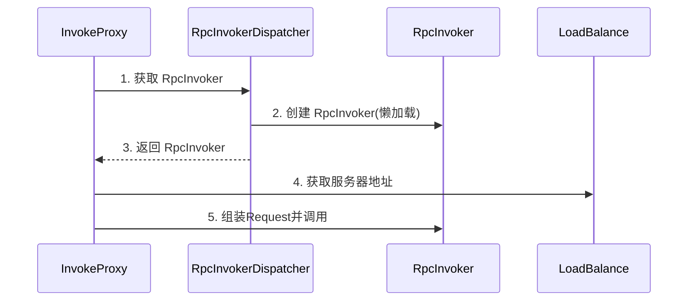

# landboat-rpc

RPC framework

## TODO LIST

- Consumer 调用形式的解耦，满足多协议调用
- Consumer 中的 Channel 保存方法
- Provider 和 Consumer 的监听器模块(Monitor 功能可能采用监听器的形式实现)
- Consumer 和 Provider 双端的注解字段明确
- LandBalance 模块，需要 Consumer 模块完善服务地址保存的方式
- Provider 端的异常处理形式统一，定义包含异常的 Response
- Netty 不同的序列化方式介入
- 支持异步和同步的调用方式

 

## Consumer 的调用流程

Consumer 使用 JDK 的动态代理实现远程调用的功能，所以切入点也就在 InvocationHandler 的实现。

landboat-rpc 使用 InvokeProxy 作为动态代理的 InvocationHandler，每一个接口对应一个 InvocationHandler，创建时解析接口上的注解。

> Consumer 只能将服务声明到接口上，抽象类或普通类无法调用。

